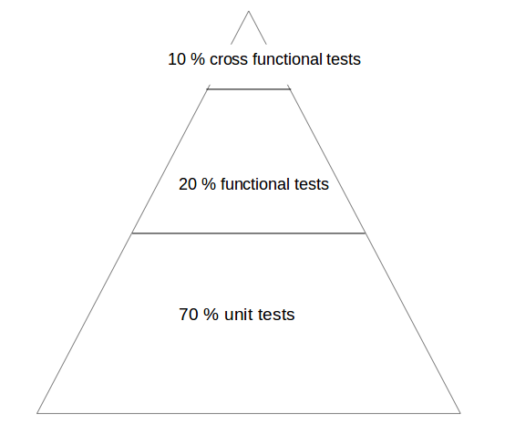
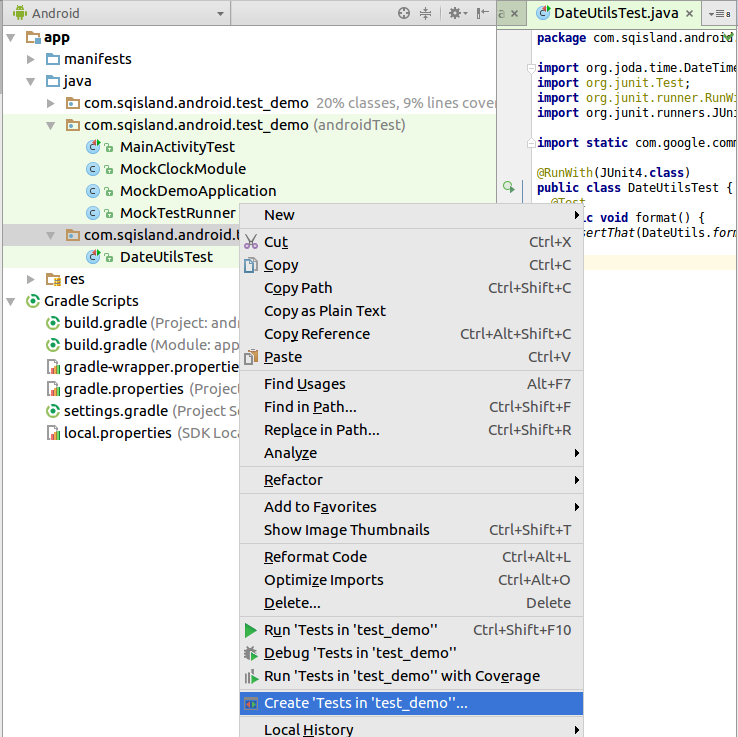
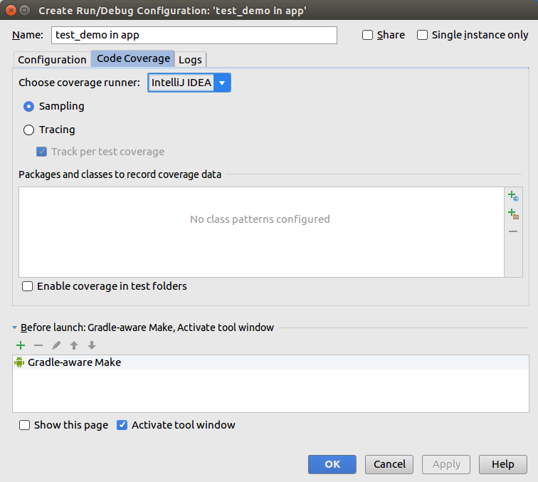
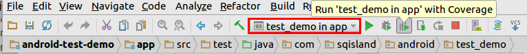
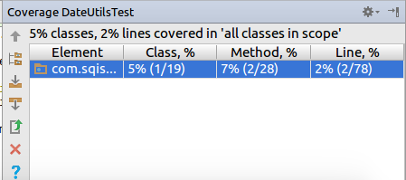
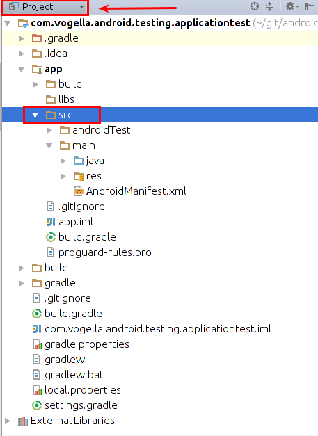
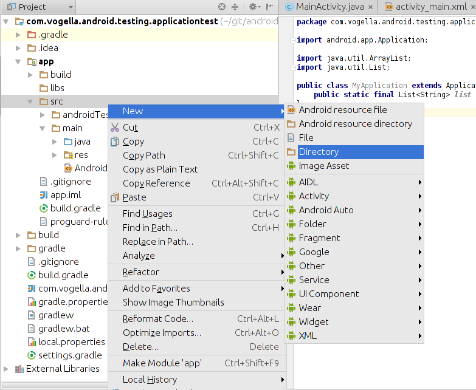
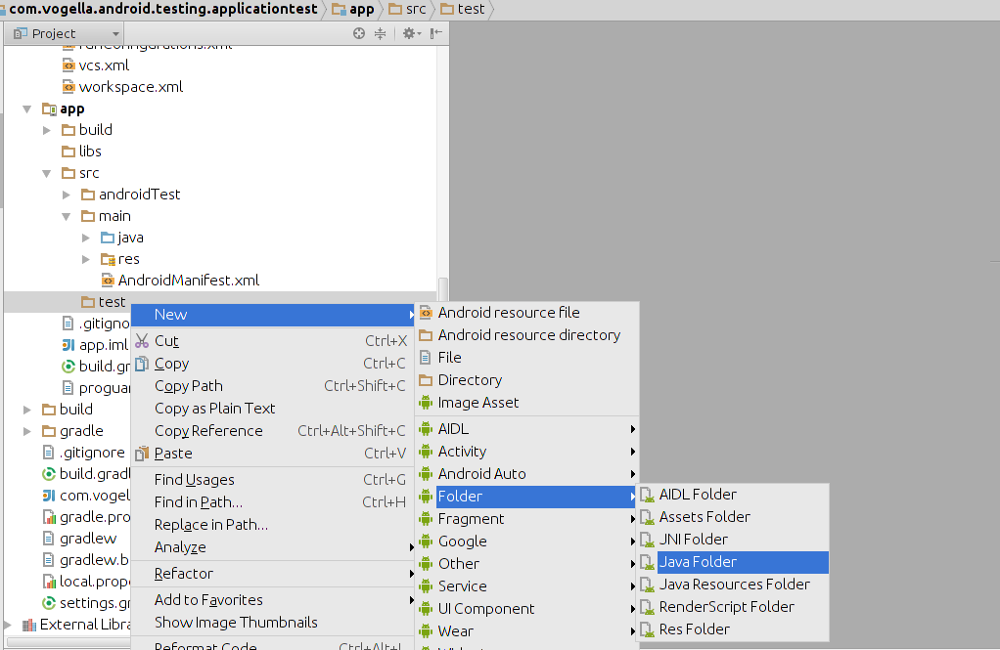
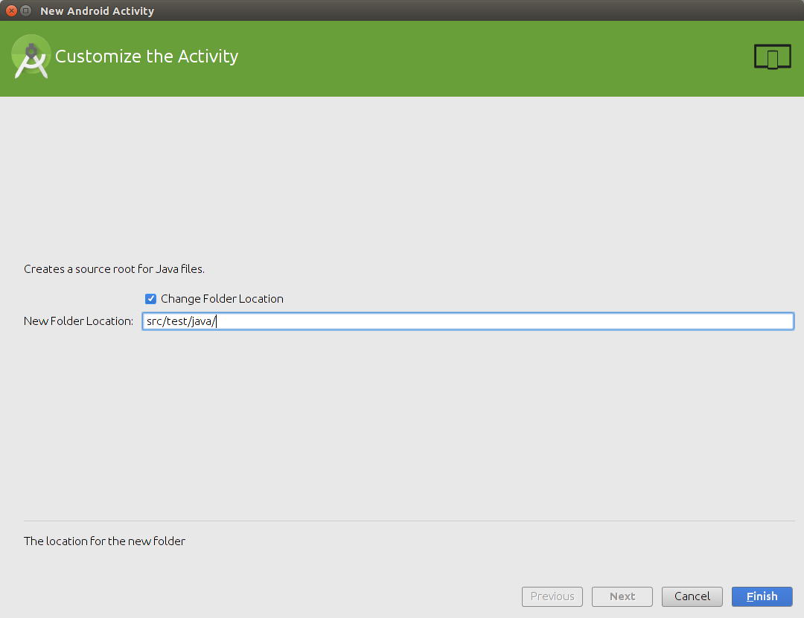

本教程介紹如何編寫單元和機上測試您的Android應用程序。它描述了如何通過執行Android的工作室和Gradle這些測試。本教程假定您熟悉一般的Android編程。

 
# 1.引入Android的測試
## 1.1。測試Android應用程序
Android應用程序在內存有限，CPU電源和電源設備上運行。該應用程序的行為也取決於外部因素，如連接，一般的系統利用率等。因此，它是調試，測試非常重要和優化Android應用程序。有一個合理的測試覆蓋率為你的Android應用程序可以幫助您提高和保持Android應用程序。

因為它不可能對所有可能的設備配置測試Android應用程序，它是一種常見的做法上運行的典型設備配置的Android測試。你應該盡可能低的配置測試一台設備上的至少有應用。此外，您應該測試一台設備上提供最高的配置，例如，像素密度，屏幕分辨率，以確保其工作正常，在這些設備上。

Android的單元測試可以分為：

本地單元測試 - 這可以在JVM上運行測試。如果可能的話，你應該更喜歡使用本地測試。本地測試運行得更快相比，部署和Android設備上運行的檢測所需的時間。

機上單元測試 - 這需要Android系統的測試。如果你想測試它使用Android API代碼，你需要在Android設備上運行這些測試。不幸的是，這使得測試較長的執行時間。


## 1.2。Android應用程序要測試什麼
你應該專注於測試應用程序的業務邏輯，你的Android的測試。一個好的經驗法則是有測試的分佈如下：

+ 70-80％的單元測試，以確保您的代碼基礎的穩定性

+ 20-30％的功能測試，以確保應用程序真正起作用

+ 如果您的應用程序與其他應用程序組件集成密集一些交叉功能測試



測試策略為Android
用於測試的另一個重要標準是，如果你只測試自己的應用程序，或者如果你測試與其他應用程序的集成。如果你的應用程序中運行測試，你可以使用需要關於您的應用程序，例如，視圖ID的一些知識測試框架。

## 1.3。測試的先決條件
這是Android的測試很好的做法，被稱為一種方法testPreconditions()測試對於所有其他測試的先決條件。如果此方法失敗，你馬上就知道了其他測試的假設受到了侵犯。

## 1.4。Android的測試工具支持
用一個JUnit 4兼容的測試運行（AndroidJUnitRunner）Android的測試支持庫（ATSL）的支持測試。您可以運行在Java虛擬機上或在Android運行單元測試。此外，谷歌提供了一個叫做Espresso用戶界面測試框架，允許開發Android的用戶界面測試。

為了讓在JVM上運行Android單元測試，Android的Gradle插件創建的android.jar的特殊版本（也稱為Android mockable jar）。使所有字段，方法和類可用此文件被提供給所述單元測試。任何調用到Android mockable JAR結果，默認情況下，在一個例外。

因此，如果你的類不呼叫Android的API，可以使用的JUnit測試框架（或任何其他Java測試框架）沒有任何限制。如果您有依賴於Android的API，這些依賴於你的代碼必須更換為單元測試，例如，通過類似的Mockito嘲弄框架。見在嘲笑的android.jar激活方法默認返回值的信息，如何定義應該從Android mockable罐子可以返回默認值。

Android的測試支持庫提供的功能來創建並運行Android測試。庫中包含AndroidJUnitRunner的Espresso測試框架和UI的Automator。

AndroidJUnitRunner允許創建和運行JUnit 4測試，而Espresso測試框架可以用來測試應用程序的用戶界面。UI的Automator允許編寫跨應用的功能測試。

AndroidJunitRunner提供了訪問機上API，通過InstrumentationRegistery。

+ InstrumentationRegistry.getInstrumentation()，返回機上當前正在運行。

+ InstrumentationRegistry.getContext()，返回此機上的軟件包的上下文。

+ InstrumentationRegistry.getTargetContext()返回目標應用程序的應用程序上下文。

+ InstrumentationRegistry.getArguments()返回傳遞給該機上參數包的副本。當你要訪問傳遞給機上為您的測試命令行參數，這非常有用。

它也可通過可訪問的生命週期ActivityLifecycleMonitorRegistry。

# 2. Android項目結構和測試文件夾創建
## 2.1。Android項目組織測試
Android測試的組織的首選方法是基於一個約定。在您的應用程序項目，你應該使用下面的基本文件夾結構，為您的代碼組織。這也是Android項目精靈創建的結構。

+ app/src/main/java - 你的主應用程序生成的源代碼
 
+ app/src/test/java - 對於可運行在JVM上的任何單元測試

+ app/src/androidTest/java - 對於本應在Android設備上運行的任何測試

如果按照這個轉換，那麼Android的構建系統可以自動運行您的正確的目標（JVM或Android設備）的測試。

## 2.2。解決"路徑錯誤重複文件"錯誤
如果您收到以下錯誤信息："在歸檔路徑路徑錯誤重複文件：LICENSE.TXT”你可以添加以下到您的app/gradle.build文件。

```yaml
android {
    packagingOptions {
    exclude 'LICENSE.txt'
    }
}
```
#3.在JVM上單元測試
## 3.1。在Android的單元測試
Android使用的unit tests，可以在本地JVM或Android運行時運行測試。

一個單元測試驗證特定的孤立的組件的功能。例如，假設在Android活動的一個按鈕用於啟動另一個活動。單元測試將確定，如果相應的意圖發出，沒有第二項活動被啟動。

單元測試是針對修改後的版本執行android.jar，所有最後的修飾已經被扒掉的Android庫。這允許您使用嘲諷的庫，例如的Mockito。

## 3.2。單元測試地點
另外，如為測試Android項目組織的Android項目的單元測試應設在app/src/test文件夾中。見Android Studio中的測試文件夾創建為建立這樣一個test文件夾中。

## 3.3。Gradle構建文件需要的依賴
要使用JUnit測試您的Android應用程序，你需要將它作為依賴添加到您的Gradle構建文件。
```yaml
dependencies {
    // Unit testing dependencies
    testCompile 'junit:junit:4.12'
    // Set this dependency if you want to use the Hamcrest matcher library
    testCompile 'org.hamcrest:hamcrest-library:1.3'
    // more stuff, e.g., Mockito
}
```
## 3.4。從Gradle運行單元測試
使用gradlew test命令運行單元測試。

## 3.5。從Android Studio中的運行單元測試
要運行單元測試，就在您的測試類右鍵單擊項目窗口，然後選擇run。

Android Studio中運行單元測試
## 3.6。測試報告的位置
測試報告中創建的app/build/reports/tests/debug/`directory. The `index.html給出了一個概述，並鏈接到各個測試頁面。

## 3.7。激活默認返回值在嘲笑的android.jar方法
默認情況下，所有的調用在修改方法android.jar的文件拋出異常。此默認應該確保你的單元測試只是測試你的代碼，不依賴於Android平台的任何特定行為。如果要配置一定的行為，你可以使用一個嘲諷的框架，以取代這些電話。

您還可以指示Gradle構建系統在`android.jar`返回默認值給方法調用，其值在Gradle構建文件中配置。

```
android {
  // ...
  testOptions {
    unitTests.returnDefaultValues = true
  }
}
```
# 4.練習：寫一個Android的單元測試
## 4.1。準備：創建Android項目
創建Android溫度轉換的項目。

## 4.2。練習：創建單元測試
### 4.2.1。這項工作的目標
在這個練習中，您將學習如何為Android項目創建一個簡單的JUnit4測試。

### 4.2.2。添加JUnit的依賴
確保您的應用程序/文件的build.gradle有依賴於JUnit。如果測試文件夾在你的項目丟失，請按照所描述的過程於Android Studio中創建它的測試文件夾。
```
dependencies {
        // Unit testing dependencies
        testCompile 'junit:junit:4.12'
}
```
### 4.2.3。創建測試
在你的`app/src/test`目錄下創建了以下兩種測試方法`ConverterUtil`的類。
```
package com.vogella.android.temperature.test;

import static org.junit.Assert.*;

import org.junit.After;
import org.junit.Before;
import org.junit.Test;

import com.vogella.android.temperature.ConverterUtil;

public class ConverterUtilTest {

        @Test
        public void testConvertFahrenheitToCelsius() {
                float actual = ConverterUtil.convertCelsiusToFahrenheit(100);
                // expected value is 212
                float expected = 212;
                // use this method because float is not precise
                assertEquals("Conversion from celsius to fahrenheit failed", expected,
                                actual, 0.001);
        }

        @Test
        public void testConvertCelsiusToFahrenheit() {
                float actual = ConverterUtil.convertFahrenheitToCelsius(212);
                // expected value is 100
                float expected = 100;
                // use this method because float is not precise
                assertEquals("Conversion from celsius to fahrenheit failed", expected,
                                actual, 0.001);
        }

}
```
## 4.2.4。運行單元測試
確保您的單元測試是通過運行測試的測試正確實施。他們應該成功運行。


# 5.撰寫機上測試以在Android設備上運行
## 5.1。機上測試
Android的測試API提供了鉤子，進入Android的組件和應用程序的生命週期。這些掛鉤被稱為機上的API，允許你的測試，以控制的生命週期和用戶交互事件。

在正常情況下你的應用程序無法控制生命週期事件和用戶驅動的應用程序。例如，如果Android的創建您的活動onCreate()方法被調用。或者，如果用戶按下按鈕的相應代碼被調用。通過機上可以控制通過您的測試代碼這些事件。例如，您的機上測試可以開始活動。然後，它可以調用finish()和重新啟動的活性測試，如果該活動的實例狀態被正確地恢復。

機上單元測試是在Android設備和仿真器，而不是Java虛擬機上運行的運行單元測試。這些測試可以訪問實際設備及其資源，並且進行單元測試功能，它不能由嘲笑框架容易地嘲笑有用。一個例子是一個測試這驗證一個Parcelable實現。

基於機上測試類允許您發送測試關鍵事件（或觸摸事件）到應用程序。

有了這樣的Espresso用戶界面測試框架，開發人員很少有直接使用機上API。

## 5.2。Android系統如何執行測試
InstrumentationTestRunner是Android測試基本測試運行。該測試運行啟動，並裝載測試方法。通過機上API它與Android系統進行通信。如果你開始一個測試Android應用程序，Android系統殺死被測試的應用程序的任何過程，然後加載一個新的實例。它不啟動應用程序，這是的測試方法的責任。測試方法控制的應用程序的組件的生命週期。

測試運行還調用onCreate()它的初始化過程中測試的應用程序和活動的方法。

## 5.3。在Android的嘲諷對象
該模擬框架的Mockito也可用於機上測試。這使您可以更換這是不是測試有趣的Android系統的組成部分。在過去提供的Android框架專門嘲諷類，但這些都沒有必要了。

## 5.4。機上機上測試位置
另外，如為測試Android項目組織的Android項目的單元測試應設在app/src/androidTest/java文件夾中。見Android Studio中的測試文件夾創建為建立這樣一個test文件夾中。

## 5.5。定義依賴和testInstrumentationRunner在Gradle構建文件
要使用JUnit測試您的Android應用程序，你需要依賴添加到JUnit來的Gradle構建文件。您還需要指定android.support.test.runner.AndroidJUnitRunner在生成文件testInstrumentationRunner。
```
defaultConfig {
       ..... more stuff
        testInstrumentationRunner "android.support.test.runner.AndroidJUnitRunner"
    }

dependencies {
    // Unit testing dependencies
    androidTestCompile 'junit:junit:4.12'
    // Set this dependency if you want to use the Hamcrest matcher library
    androidTestCompile 'org.hamcrest:hamcrest-library:1.3'
    // more stuff, e.g., Mockito
}
```
## 5.6。使用@RunWith（AndroidJUnit4.class）
此外，還建議註釋與測試@RunWith(AndroidJUnit4.class)註釋。AndroidJUnit4擴展JUnit4，所以如果你用純Junit4語法和ActivityTestRule它不是必需的。但是，你需要它，如果你想運行，也就是說，Espresso測試，ActivityTestRule和JUnit4。

## 5.7。從運行的Gradle單元測試
運行單元測試的gradlew connectedCheck命令。

## 5.8。從運行的Android Studio中的單元測試
就在您的測試類右鍵單擊項目窗口，然後選擇運行。

## 5.9。測試報告位置
測試報告中所創建的app/build/reports/androidTests/connected/目錄中。在index.html給出的概述和鏈接到單個測試頁。

## 5.10。如何更換為機上測試應用程序
您可以通過重寫替換的機上測試應用程序類AndroidJUnitRunner和它的newApplication方法。
```java
package com.vogella.android.daggerjunitmockito;

import android.app.Application;


public class MyMockApplication extends Application {

    @Override
    public void onCreate() {
       // do something important for your tests here
    }
}
```
測試運行
```java
package com.vogella.android.daggerjunitmockito;

import android.app.Application;
import android.content.Context;
import android.support.test.runner.AndroidJUnitRunner;

public class MockTestRunner extends AndroidJUnitRunner {
  @Override
  public Application newApplication(ClassLoader cl, String className, Context context)
      throws InstantiationException, IllegalAccessException, ClassNotFoundException {
    return super.newApplication(cl, MyMockApplication.class.getName(), context);
  }
}
```
而你需要在你的build.gradle文件中註冊該測試運行。
```yaml
android {
    /// more
        testInstrumentationRunner "com.vogella.android.daggerjunitmockito.MockTestRunner"
    }
    /// more
}
```
# 6.練習：Mocking文件訪問
## 6.1。這項工作的目標
它不要求你的Android應用程序來使用這個類。它僅用於演示在單元測試的Mockito的用法。

## 6.2。創建類來測試
在現有的或與包新的Android應用程序com.vogella.android.testing.mockitocontextmock 中添加下面的類。
```java
public class Util {
        public static void writeConfiguration(Context ctx ) {
                try (FileOutputStream openFileOutput =
                         ctx.openFileOutput( "config.txt", Context.MODE_PRIVATE);) {

                        openFileOutput.write("This is a test1.".getBytes());
                        openFileOutput.write("This is a test2.".getBytes());
                } catch (Exception e) {
                        // not handled
                }
        }
}
```
## 6.3。創建一個新的單元測試
使用的的Mockito模擬框架，編寫一個單元測試，驗證了：* openFileOutput被調用一次*該write()	方法被調用至少兩次。
```java
package com.vogella.android.testing.mockitocontextmock;

import android.content.Context;

import org.junit.Before;
import org.junit.Test;
import org.junit.runner.RunWith;
import org.mockito.Mock;
import org.mockito.MockitoAnnotations;

import java.io.FileOutputStream;

import static org.junit.Assert.fail;
import static org.mockito.Matchers.any;
import static org.mockito.Matchers.anyInt;
import static org.mockito.Matchers.anyString;
import static org.mockito.Mockito.atLeast;
import static org.mockito.Mockito.times;
import static org.mockito.Mockito.verify;
import static org.mockito.Mockito.when;

public class TextContextOutputStream {

@Mock
Context context;

@Mock
FileOutputStream fileOutputStream;

@Before
public void init(){
    MockitoAnnotations.initMocks(this);
}

    @Test
public void writeShouldWriteTwiceToFileSystem() {
    try {
        when(context.openFileOutput(anyString(), anyInt())).thenReturn(fileOutputStream);
        Util.writeConfiguration(context);
        verify(context, times(1)).openFileOutput(anyString(), anyInt());
        verify(fileOutputStream, atLeast(2)).write(any(byte[].class));

    } catch (Exception e) {
        e.printStackTrace();
        fail();
    }
}
}
```
# 7.活動測試
見有EspressoAndroid用戶界面的測試，並與UI的Automator交叉組件測試 。

# 8.更在Android測試
## 8.1。Android的額外斷言
Android的測試API提供了MoreAsserts和ViewAsserts類，除了標準的JUnit Assert類。

## 8.2。測試群組
該@SmallTest`@ MediumTest`and`@ LargeTest`annotations允許進行分類測試。

這使您可以運行，例如，只是短期運行測試。你可以在持續集成服務器上運行長時間的運行測試。

僅運行選定的測試，您可以配置InstrumentationTestRunner通過您的Gradle插件。下面的列表為您的示例build.gradle文件只運行帶有註釋的測試@SmallTests。
```yaml
android {
  //....
  defaultConfig {
  //....
    testInstrumentationRunner "android.support.test.runner.AndroidJUnitRunner"
    testInstrumentationRunnerArgument "size", "small"
  }
}
import android.test.suitebuilder.annotation.MediumTest;
import android.test.suitebuilder.annotation.SmallTest;

import org.junit.Test;

public class ExampleTest {

    @Test
    @SmallTest
    public void validateSecondActivity() {
        // Do something not so long...
    }

    @Test
    @MediumTest
    public void validateSecondActivityAgain() {
        // Do something which takes more time....
    }

}
```
## 8.3。測試篩選
你可以用註釋標註測試。Android的測試運行器可以過濾這些測試。

表1.註釋過濾測試
|註解|描述|
|:---|:---|
|@RequiresDevice|指定測試只應在物理設備不是模擬器運行。
|@SdkSupress|@SDKSupress（的minSdkVersion = 18）
## 8.4。片狀試驗
Android中的行為有時與時間有關。告訴Android的重複測試，一旦失敗，則使用@FlakyTest註釋。經由tolerance這個註釋可以定義多少次試驗應標記為失敗之前被重複的屬性。

# 9.練習：生命週期測試
## 9.1。這項工作的目標
在這個練習中的機上測試框架是證明。對於這樣的測試，你通常會使用更高級別的框架，如Espresso。

## 9.2。創建一個測試項目
創建一個新的Android項目名為com.vogella.android.test.simpleactivity與所謂的活動MainActivity。

添加稱為第二個活動SecondActivity到項目中。此活動應該使用的佈局與至少一種TextView。的的ID TextView應該是“resultText”，其文本應設置為“已啟動”。

在加入EditText場的佈局MainActivity類。

將按鈕添加到您使用的佈局MainActivity行為。如果單擊此按鈕，第二個活動應啟動。

將文本EditText字段作為額外的使用將“文本”作為關鍵的意圖。也把“http://www.vogella.com”String作為額外的進入意圖和使用密鑰“URL”這一點。

下面是一些示例代碼MainActivity。
```java
package testing.android.vogella.com.simpleactivity;

import android.app.Activity;
import android.content.Intent;
import android.os.Bundle;
import android.view.View;

public class MainActivity extends Activity {

    @Override
    protected void onCreate(Bundle savedInstanceState) {
        super.onCreate(savedInstanceState);
        setContentView(R.layout.activity_main);
    }

    public void onClick(View view) {
        Intent intent = new Intent(this, SecondActivity.class);
        intent.putExtra("URL", "http://www.vogella.com");
        startActivity(intent);
    }
}
```
## 9.3。創建測試項目和類
創建一個類似如下的新機上測試。
```java
package com.vogella.android.test.simpleactivity.test;

import android.app.Activity;
import android.app.Instrumentation;
import android.app.Instrumentation.ActivityMonitor;
import android.test.ActivityInstrumentationTestCase2;
import android.test.TouchUtils;
import android.test.UiThreadTest;
import android.test.ViewAsserts;
import android.view.KeyEvent;
import android.view.View;
import android.widget.Button;
import android.widget.TextView;

import com.vogella.android.test.simpleactivity.R;

import com.vogella.android.test.simpleactivity.MainActivity;
import com.vogella.android.test.simpleactivity.SecondActivity;

public class SecondActivityFunctionalTest extends
                ActivityInstrumentationTestCase2<SecondActivity> {

        private static final String NEW_TEXT = "new text";

        public SecondActivityFunctionalTest() {
                super(SecondActivity.class);
        }

        public void testSetText() throws Exception {

                SecondActivity activity = getActivity();

                // search for the textView
                final TextView textView = (TextView) activity
                                .findViewById(R.id.resultText);

                // set text
                getActivity().runOnUiThread(new Runnable() {

                        @Override
                        public void run() {
                                textView.setText(NEW_TEXT);
                        }
                });

                getInstrumentation().waitForIdleSync();
                assertEquals("Text incorrect", NEW_TEXT, textView.getText().toString());

        }

        @UiThreadTest
        public void testSetTextWithAnnotation() throws Exception {

                SecondActivity activity = getActivity();

                // search for the textView
                final TextView textView = (TextView) activity
                                .findViewById(R.id.resultText);

                textView.setText(NEW_TEXT);
                assertEquals("Text incorrect", NEW_TEXT, textView.getText().toString());

        }

}
```
# 10.使用猴子工具，用於創建一個隨機事件流
## 10.1。什麼是猴子？
猴子是一個命令行工具，它發送偽隨機事件到您的設備。您可以限制猴子只為某個軟件包運行，因此指示猴僅測試您的應用程序。

## 10.2。如何使用猴子
下面的命令將2000隨機事件與應用程序de.vogella.android.test.target包。
```sh
adb shell monkey -p de.vogella.android.test.target -v 2000
```
猴子有時會導致與亞洲開發銀行服務器的問題。使用以下命令重新啟動ADB服務器。
```sh
adb kill-server
adb start-server
```
可以使用-s [seed]	參數，以確保事件的生成順序始終是相同的。

有關猴子的詳細信息，請參見猴描述。

## 11.應用測試
該應用程序類包含的邏輯，數據和設置，這是相關的整個應用程序。因此，你應該測試這個對象，以確保它正常工作。

你可以寫一個JUnit 4測試應用程序對象，並測試它在JVM上。在這種情況下，你會嘲笑所有依賴於應用程序對象。要在使用Android的運行測試Android應用程序的對象ApplicationTestCase類。據預計，谷歌將很快用於測試應用程序對象，但目前這還不是可提供特殊JUnit4規則。

Android的測試的測試運行（InstrumentationTestRunner在初始化階段）會自動創建應用程序的一個實例。如果您在做異步處理onCreate方法，你應該考慮這一點。


# 12.鍛煉：測試Android應用程序
## 12.1。創建項目
創建具有新的Android應用程序com.vogella.android.testing.applicationtest基礎上，包名空活動模板。

下面的應用程序對象添加到應用程序。
```java
package com.vogella.android.testing.applicationtest;

import android.app.Application;

import java.util.ArrayList;
import java.util.List;

public class MyApplication extends Application {
    public static final List<String> list = new ArrayList<String>();
}
```
同時聲明在清單文件的應用程序了。
```xml
<?xml version="1.0" encoding="utf-8"?>
<manifest xmlns:android="http://schemas.android.com/apk/res/android"
    package="com.vogella.android.testing.applicationtest" >

    <application
        android:name=".MyApplication"
        android:allowBackup="true"
        android:icon="@mipmap/ic_launcher"
        android:label="@string/app_name"
        android:theme="@style/AppTheme" >
        <activity
            android:name=".MainActivity"
            android:label="@string/app_name" >
            <intent-filter>
                <action android:name="android.intent.action.MAIN" />

                <category android:name="android.intent.category.LAUNCHER" />
            </intent-filter>
        </activity>
    </application>

</manifest>
```
## 12.2。創建應用程序對象的單元測試
在你的app/src/test目錄中創建一個新的單元測試。斷言MyApplication.list字段不為空並已初步大小為零。

## 12.3。創建應用程序對象機上化試驗
創建基於JUnit的3測試框架下的單元測試。
```java
package com.vogella.android.testing.applicationtest;

import android.content.pm.PackageInfo;
import android.test.ApplicationTestCase;
import android.test.MoreAsserts;

public class ApplicationTest extends ApplicationTestCase<MyApplication> {

    private MyApplication application;

    public ApplicationTest() {
        super(MyApplication.class);
    }

    protected void setUp() throws Exception {
        super.setUp();
        createApplication();
        application = getApplication();

    }

    public void testCorrectVersion() throws Exception {
        PackageInfo info = application.getPackageManager().getPackageInfo(application.getPackageName(), 0);
        assertNotNull(info);
        MoreAsserts.assertMatchesRegex("\\d\\.\\d", info.versionName);
    }

}
```
# 13.測試其他組件
## 13.1。服務測試
為了測試使用服務ServiceTestRule類從Android測試支持庫。舊的ServiceTestCase已被棄用。

這條規則提供了一個簡化機制之前，你的測試後，啟動和關閉服務。它保證服務成功連接起（或綁定）服務時。該服務可以使用的輔助方法之一啟動（或約束）。它會自動停止（或綁定）測試完成和@After註解的任何方法完成後。

此規則不支持IntentService因為它的後自動銷毀onHandleIntent方法。
以下列表測試的服務的一個例子。
```java
@RunWith(AndroidJUnit4.class)
@MediumTest
public class MyServiceTest {

    @Rule
    public final ServiceTestRule mServiceRule = new ServiceTestRule();

    // test for a service which is started with startService
    @Test
    public void testWithStartedService() {
        mServiceRule.
        startService(new Intent(InstrumentationRegistry.getTargetContext(),
                        MyService.class));
        // test code
    }

    @Test
 // test for a service which is started with bindService
    public void testWithBoundService() {
        IBinder binder = mServiceRule.
                        bindService(new Intent(InstrumentationRegistry.getTargetContext(),
                                        MyService.class));
        MyService service = ((MyService.LocalBinder) binder).getService();
        assertTrue("True wasn't returned", service.doSomethingToReturnTrue());
    }
}
```
```sh
adb kill-server
adb start-server
```
## 13.2。內容提供商測試
為了測試內容提供商，您可以使用ProviderTestCase2類。 ProviderTestCase2自動實例測試的提供商，並插入一個IsolatedContext對象。這個上下文是從Android系統中分離，但仍允許文件和數據庫的訪問。該的使用IsolatedContext對象，確保您的供應商的測試不會影響真正的設備。

ProviderTestCase2還提供了訪問一個MockContentResolver通過getMockContentResolver()方法。

您應該測試供應商的所有業務和也，如果供應商被稱為帶有無效URI或無效的投影會發生什麼。

## 13.3。裝載機測試
要測試裝載程序，你使用`LoaderTestCase`class。預計一個JUnit 4規則將在未來被提供給替換這個類。

## 14.支持註解
谷歌提供了一個新的註解包。該軟件包包括了一些元數據註釋，你可以在你的代碼中使用，以防止錯誤。

要使用這些註解添加以下依賴你的Gradle構建文件。
```yaml
dependencies {
    compile 'com.android.support:support-annotations:22.2.0'
}
```
以下信息描述中最重要的註解。見http://tools.android.com/tech-docs/support-annotations以獲取更多信息。

## 14.1。NULL的含量註解
該@Nullable註解可以被用來指示給定參數或返回值可以為空。同樣，@NonNull註解可以被用來指示一個給定的參數（或返回值）不能為空。

## 14.2。線程註釋：@UiThread，@WorkerThread，...
如果一個方法只能從特定類型的線程中調用，可以與以下註釋之一將其標註為：

+ @UiThread

+ @manthread

+ @WorkerThread

+ @BinderThread

例：
```java
@WorkerThread
protected abstract Result doInBackground(Params... params);

@MainThread
  protected void onProgressUpdate(Progress... values) {
  }
```
# 15.創建代碼覆蓋率報告
一個代碼覆蓋率報告顯示有多少你的應用程序代碼測試所覆蓋。要創建這樣的報告，可以創建一個單獨的啟動配置。為此，選擇你的包，然後選擇菜單：創建測試...]。


現在，您可以創建代碼覆蓋率運行時配置。如果你運行它生成報告。






# 16.測試文件夾創建Android Studio中
最近的Android工作室的版本增加了一個測試文件夾到它的默認項目模板。如果你正在使用的不創建一個測試文件夾模板，您必須手動創建它。要創建Android Studio中test文件夾，切換到項目視圖，這說明你項目的目錄結構。


選擇src和使用上下文菜單來創建一個新的測試文件夾。





如果還沒有完成，還加了JUnit依賴你的Gradle構建文件。
```yaml
dependencies {
    // Unit testing dependencies
    testCompile 'junit:junit:4.12'
    // Set this dependency if you want to use the Hamcrest matcher library
    testCompile 'org.hamcrest:hamcrest-library:1.3'
    // more stuff, e.g., Mockito
}
```
Java文件夾的創建可能會添加新的測試目錄作為源文件到你的build.gradle文件。如果你在你的下面的項app/build.gradle文件，你需要將其刪除。測試不應該被視為正常的源文件夾。

 sourceSets { main { java.srcDirs = ['src/main/java', 'src/test/java/'] } }
之後您可以將單元測試添加到該文件夾結構。


 
# 17.關於本網站
支持的免費內容

支持免費教程
提問和討論

提問和討論
教程及代碼許可證

執照
獲取源代碼

源代碼
# 18. Android的測試資源
從谷歌Android的測試實例

從谷歌Android的測試模板項目

從谷歌Android測試代碼實驗室

Android的測試卡塔

從谷歌的單元測試的支持說明

使用Robolectric有關JVM Android的單元測試

與EspressoAndroid用戶界面測試

邱基燦關於Espresso的依賴注入的模擬應用

阿爾喬姆Zinnatullin博客帖子上如何嘲笑在單元，集成和功能測試的依賴; 匕首，Robolectric和機上

## 18.1。vogella有限公司的培訓和諮詢支持
訓練	服務與支持
該公司vogella提供全面的培訓和教育服務， 在Eclipse RCP的，Android的，Git的，爪哇，Gradle和Spring的領域的專家。我們提供公共和室內訓練。當然，無論你決定採取，你保證你提到的前經歷了許多：“我參加過的最好的IT類”。
該公司vogella提供專家諮詢服務，開發支持和指導。我們的客戶範圍從財富100強企業到個人開發者。

# 附錄A：版權與許可
版權所有©2012-2016 vogella價格。免費使用的軟件示例是根據EPL許可條款授予。本教程下發表 知識共享署名-非商業性使用-相同方式共享3.0德國許可。

見許可證。
取自[Developing Android unit and instrumentation tests](http://www.vogella.com/tutorials/AndroidTesting/article.html)
使用google translate翻譯文章